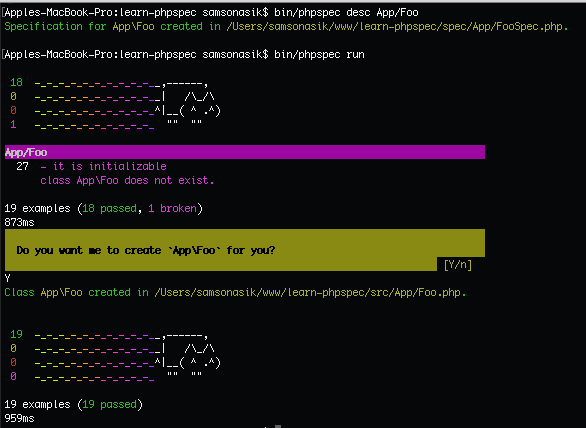

# learn-phpspec

[](https://travis-ci.org/sitrunlab/learn-phpspec)

Consume:

```bash
$ git clone https://github.com/sitrunlab/learn-phpspec.git
$ cd learn-phpspec
$ composer install
$ bin/phpspec run
```

Add new Spec:

```bash
$ bin/phpspec desc App/Foo
```

You will get `FooSpec` class with namespace `Spec\App` inside `spec` folder.

Run phpspec:

```bash
$ bin/phpspec run
```

If you don't have an `App\Foo.php` file, `phpspec` will ask for generate one for you:



And you're ready to add more tests first app!
